# Project Description
Doctorbhai is an Android app that is based on healthcare. The project is built in Android Studio platform using Java and Sqlite. In this application Users can easily log in & register. Users can do Lab Tests based on different categories . They can find their desired doctor & book an appointment, with that doctor . They can search and buy their necessary medicines through this app. There is a BMI calculator where they can calculate their BMI.  User can see health-related videos, articles & all order details. Also can find nearby ambulances and pharmacies through Google Maps. This project is still under construction . Will add other features and update existing features . 

## Software Specification 
* Android version : Marshmellow(V.6.0)
* Language : Java
* Database : Firebase
* Android Studio

## Features:
* User Login and Registration System with SQLite
* Lab Tests
* Find Doctor
* Book Appointement
* Search & Buy Medicine
* Watch Health videos & articles
* BMI calculator
* Find nearby ambulances & pharmacies through Google Map

Wanna run this app ? download this ! 

## Project Demo : 

## Splash Screen : 
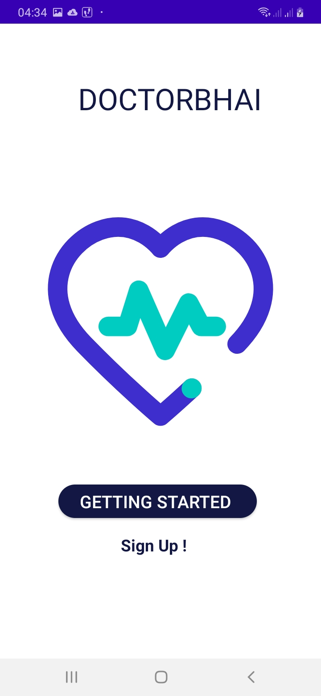  

## Login - Registration
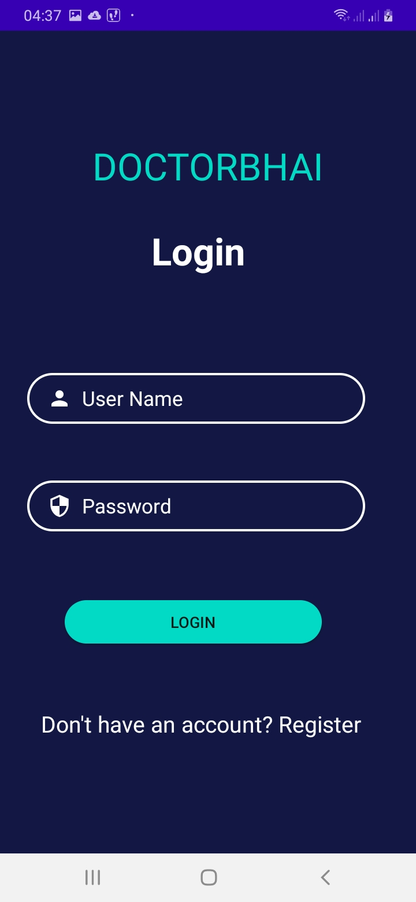  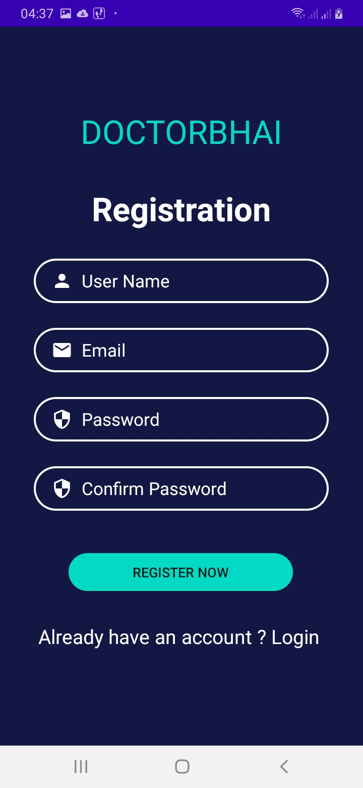

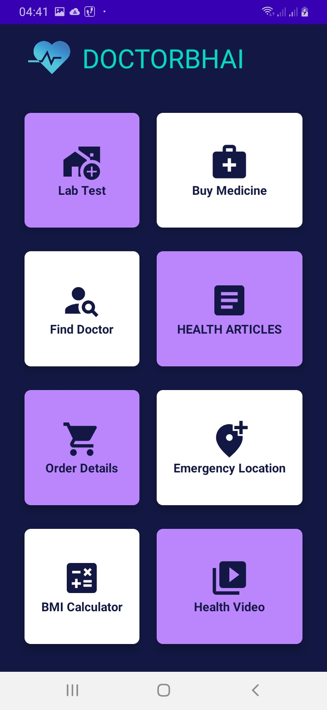     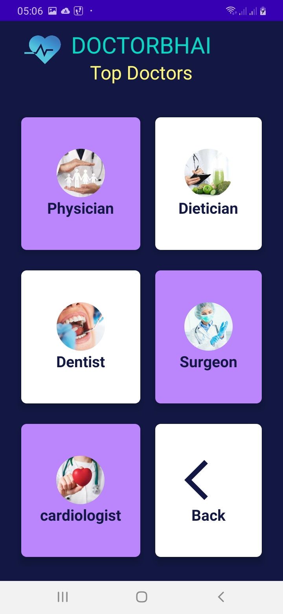 

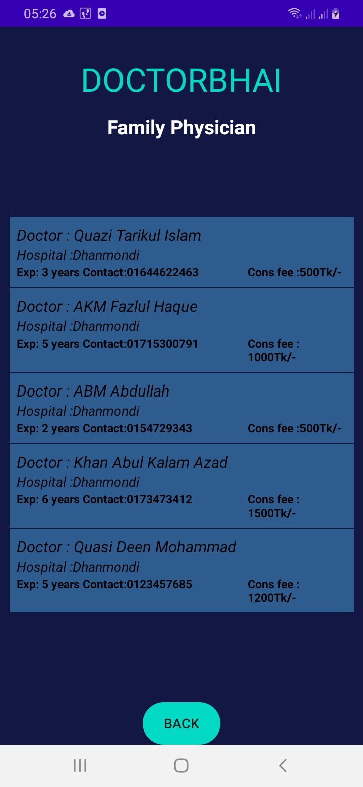     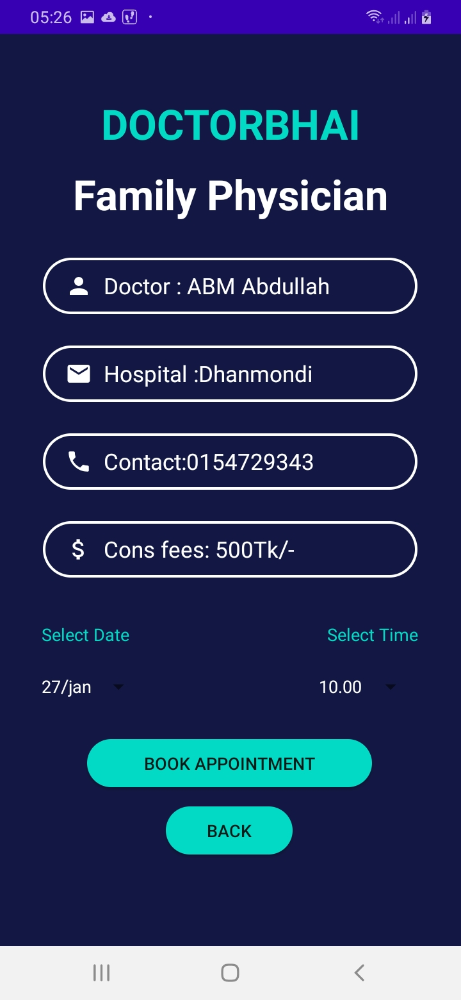 

     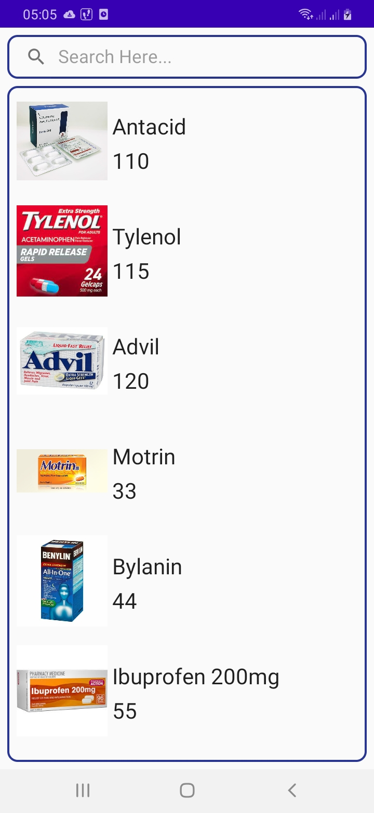 

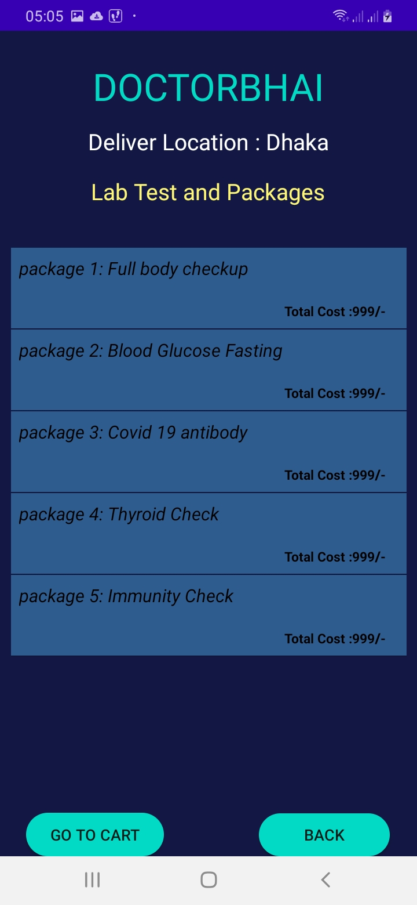     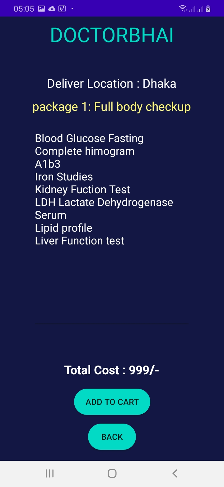 

     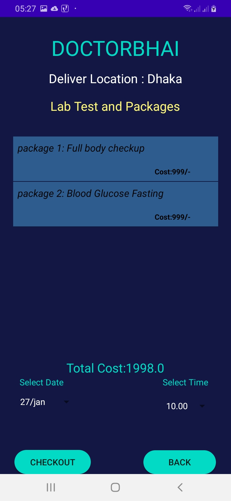 

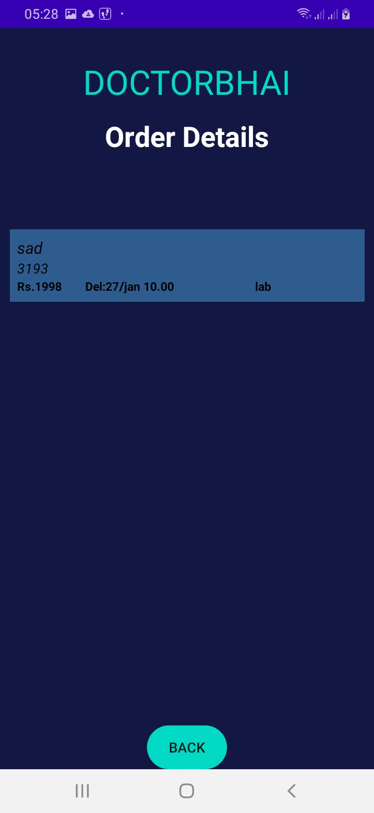     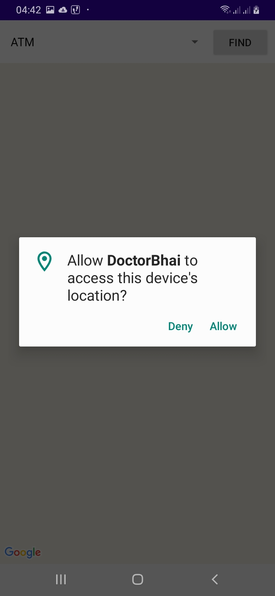 

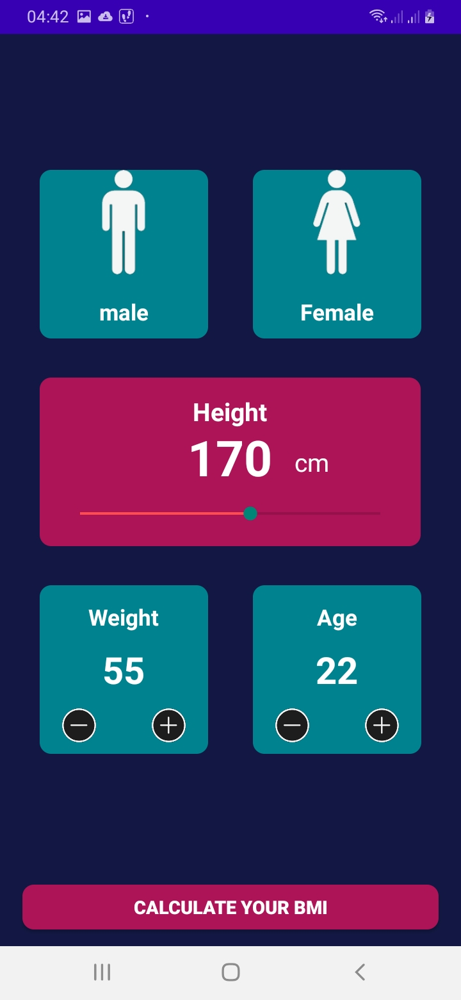    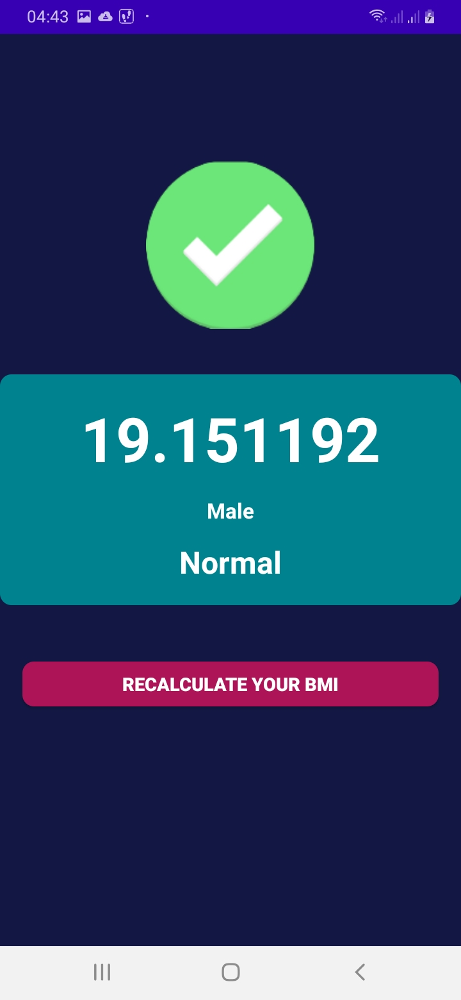    

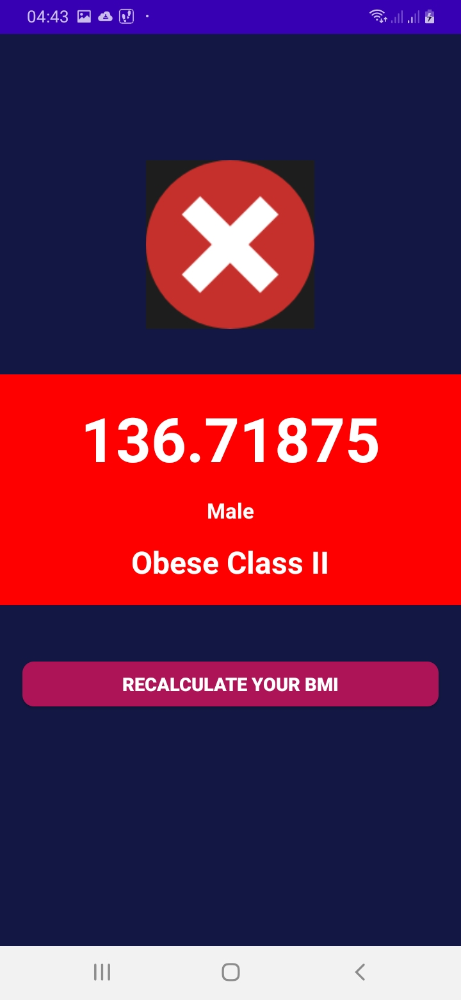    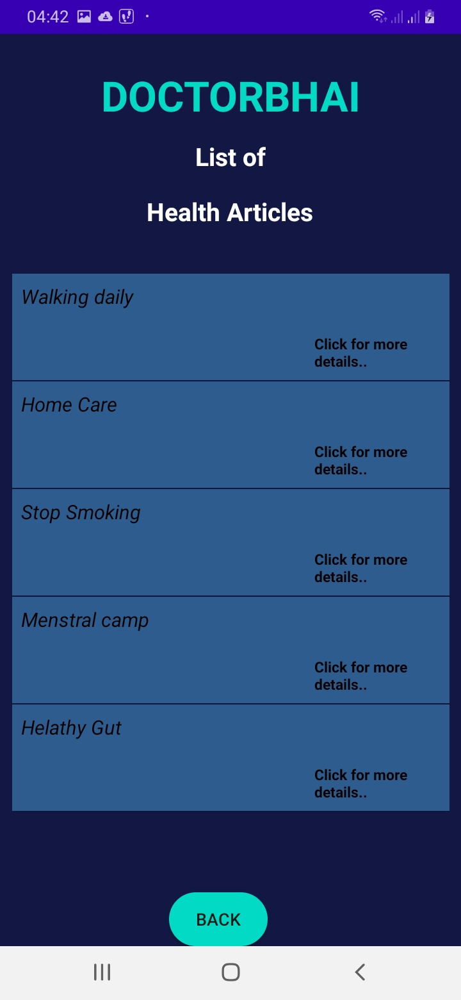    

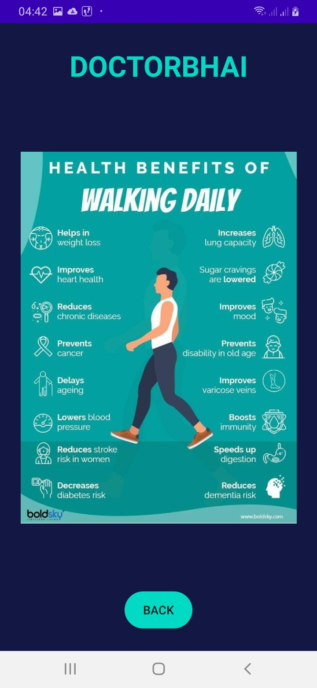    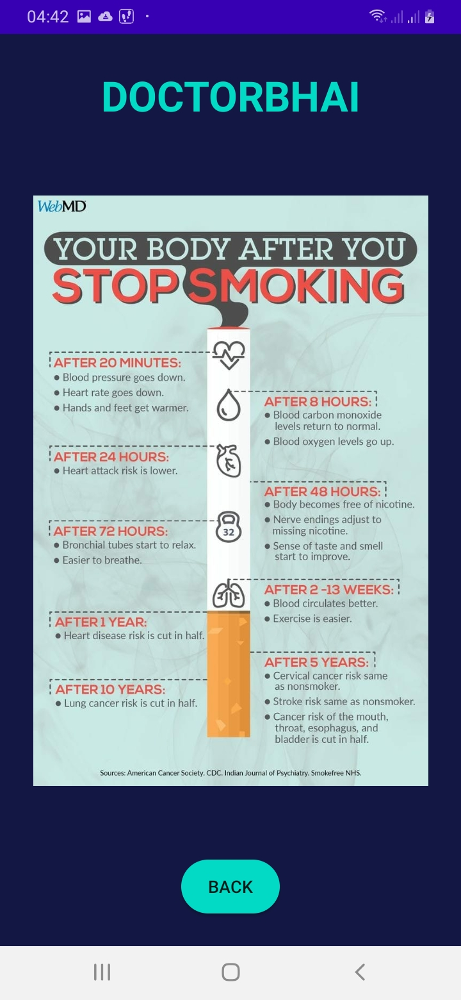    

       

